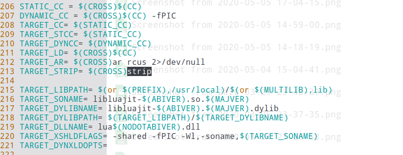
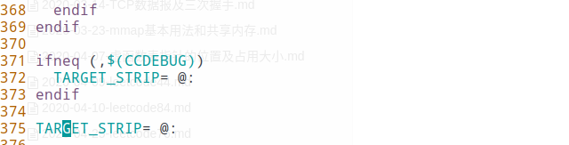

# ljstack

[](https://travis-ci.org/bbkgl/ljstack) [](https://opensource.org/licenses/MIT)

ljstack是一个能够对luajit2.1进程进行profile的工具，同时也是一个库。

## 优势

性能相当高，可以在线上开启，目标进程性能损失低于2%。

## 其他说明

### ptrace

这个问题在CLion的[帮助文档](https://www.jetbrains.com/help/clion/attaching-to-local-process.html?_ga=2.145183860.1534397970.1591426065-2040722644.1571297157)里有说明，为了避免ptrace失败，可以sudo执行进程，或者是执行如下命令：
```shell
echo 0 | sudo tee /proc/sys/kernel/yama/ptrace_scope
```

为了能够持久生效，建议修改配置，打开`/etc/sysctl.d/10-ptrace.conf`，然后把`kernel.yama.ptrace_scope`的值改成0。
保存后再执行：
```shell
echo 0 | sudo tee /proc/sys/kernel/yama/ptrace_scope
```

### luajit版本

默认情况下，支持luajit的2.0以及2.1的32位版本。

如果要支持luajit的2.1的64位版本，需要在cmake生成makefile的时候，执行：

```shell
cmake .. -DLJ_GC64
```


### luajit的符号表

默认情况下，luajit在编译的时候指定了参数，取出了部分符号，导致ljstack无法获取到符号以及对应的地址。



缺失符号表，会造成profile无法进行。

为了避免这个问题，有两种办法：

- 使用Debug模式编译luajit
- 修改MakeFile

修改MakeFile，需要在MakeFile中添加：

```makefile
TARGET_STRIP= @:
```

如下图：

